Here are visualizations for the convergence of the model and loss vs epochs for each method/dataset.

**Dataset 1**

**Full Batch Gradient Descent**
- 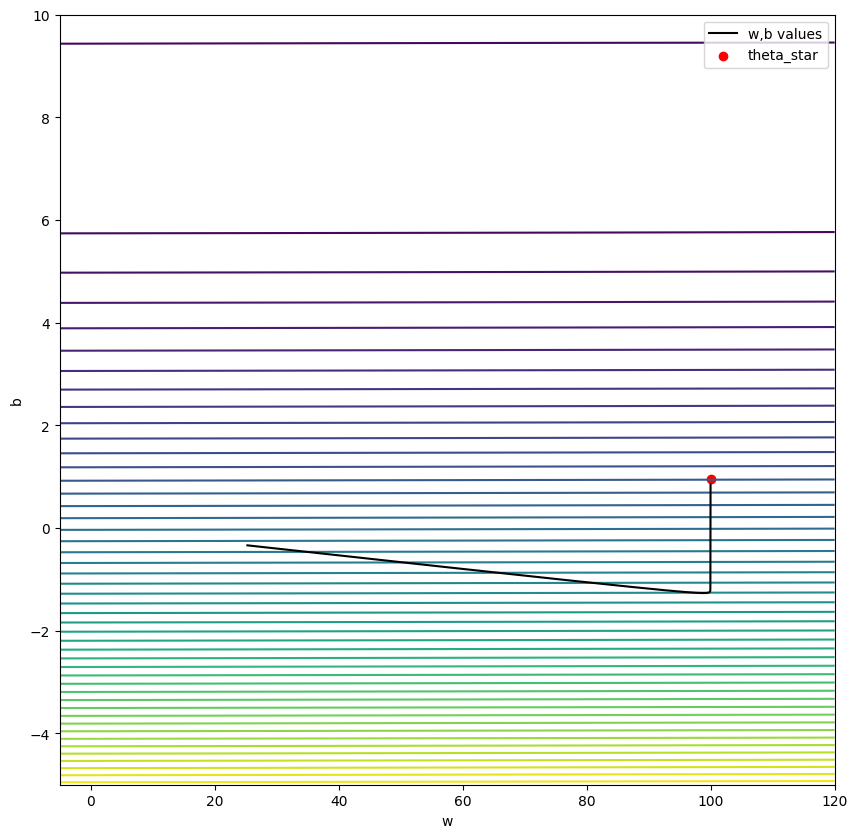
- 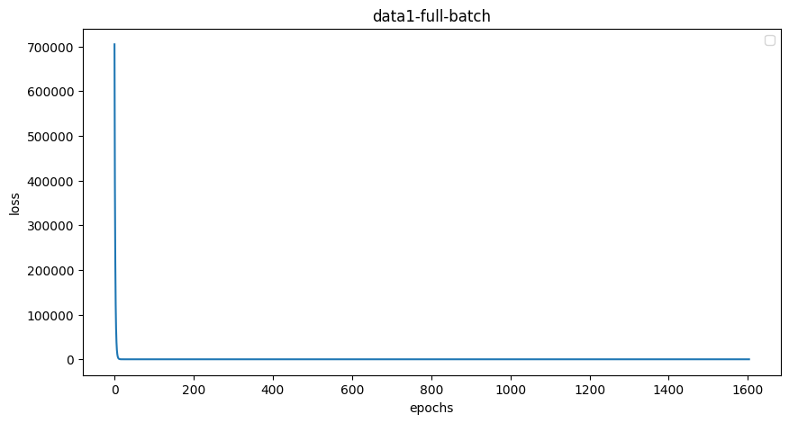
- 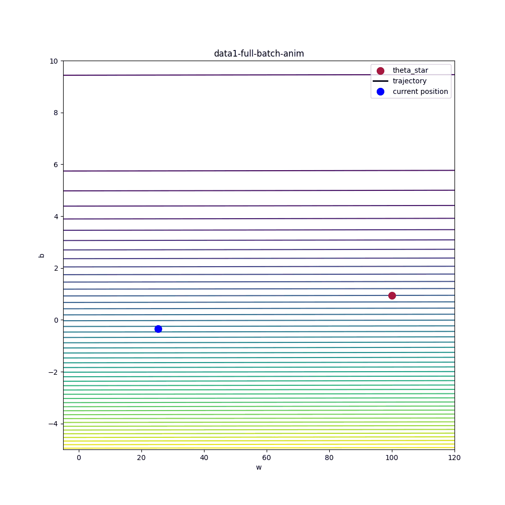

**Stochastic Gradient Descent**
- 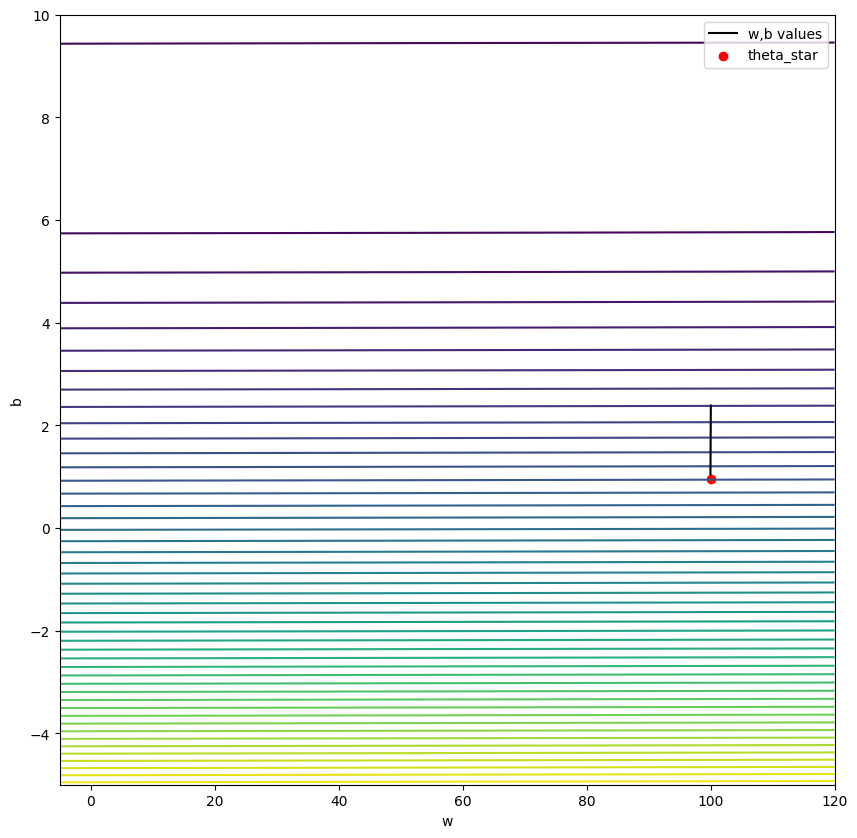
- 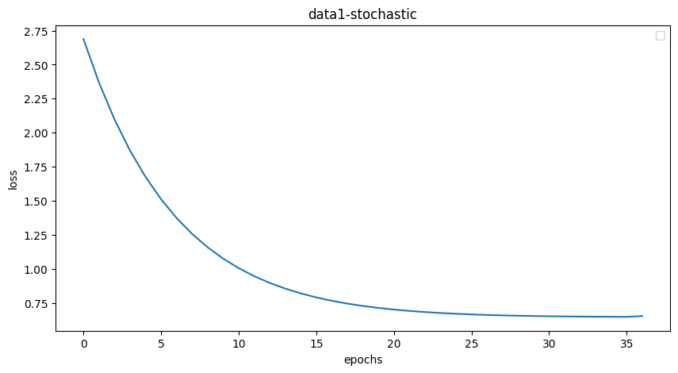
- 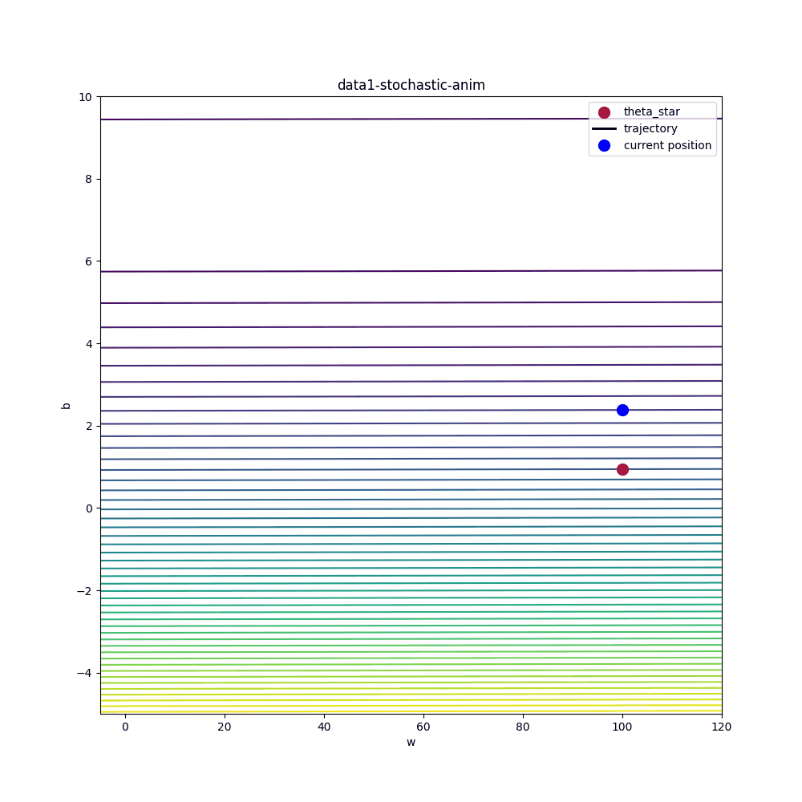

**Momentum**
- 
- 
- 

**Dataset 2**
**Full Batch Gradient Descent**
- 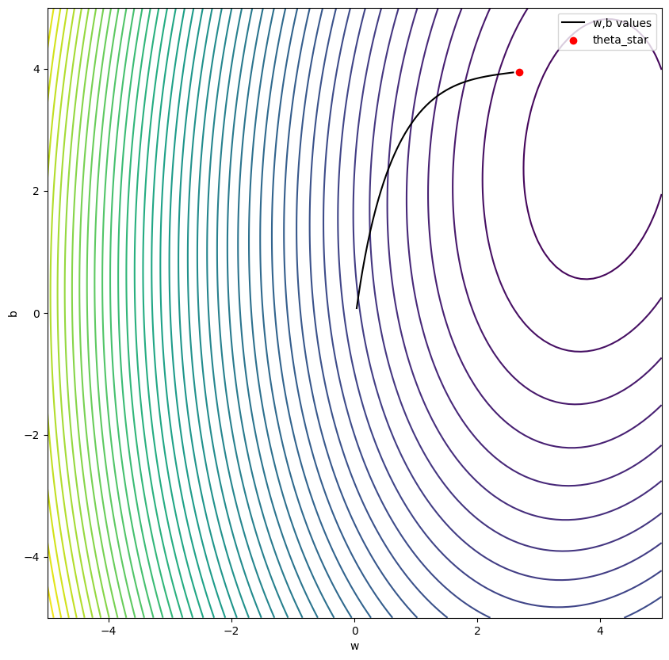
- 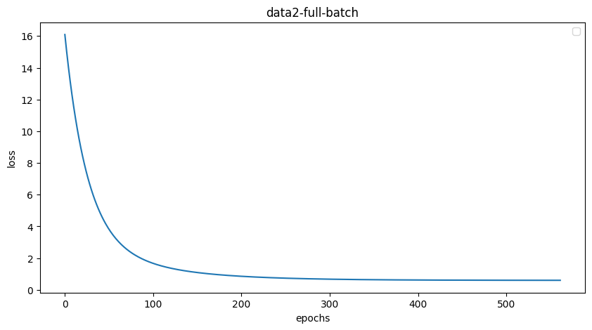
- 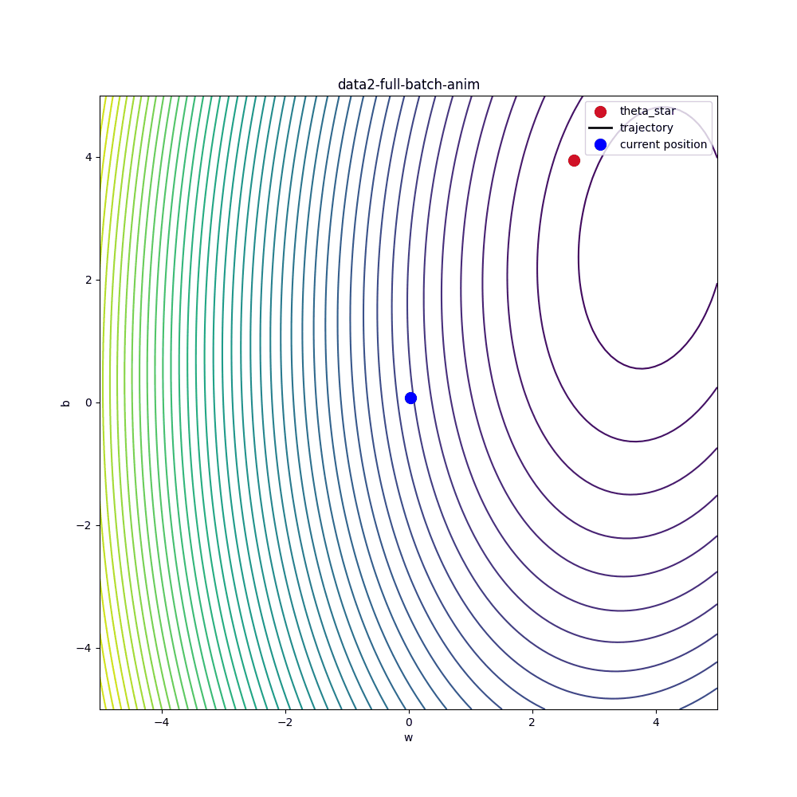

**Stochastic Gradient Descent**
- 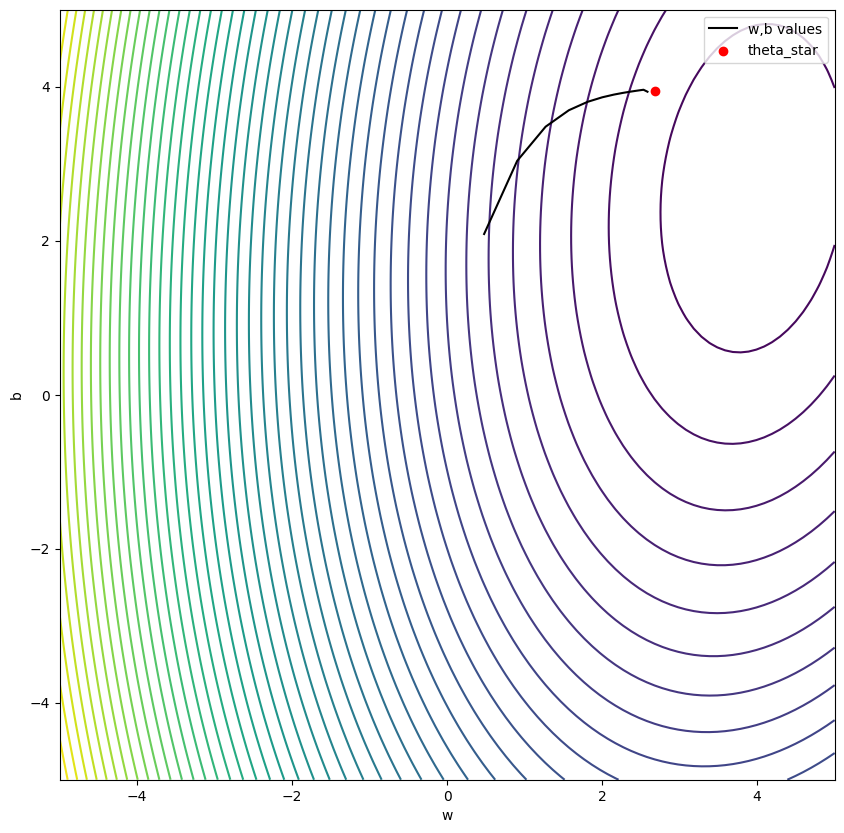
- 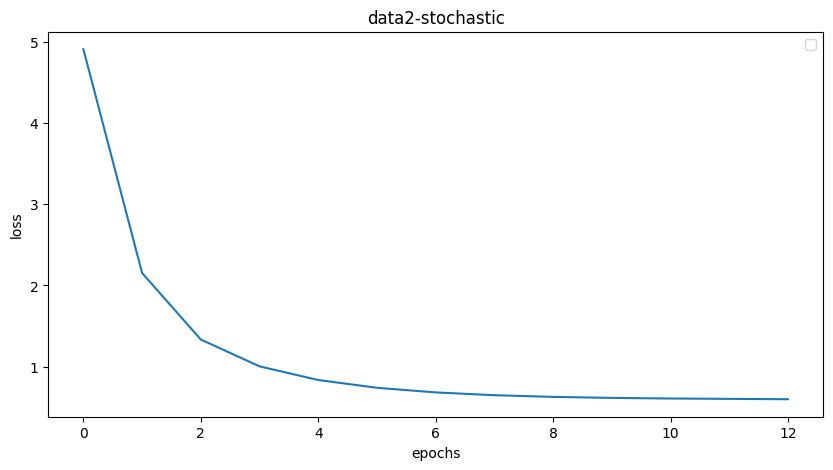
- 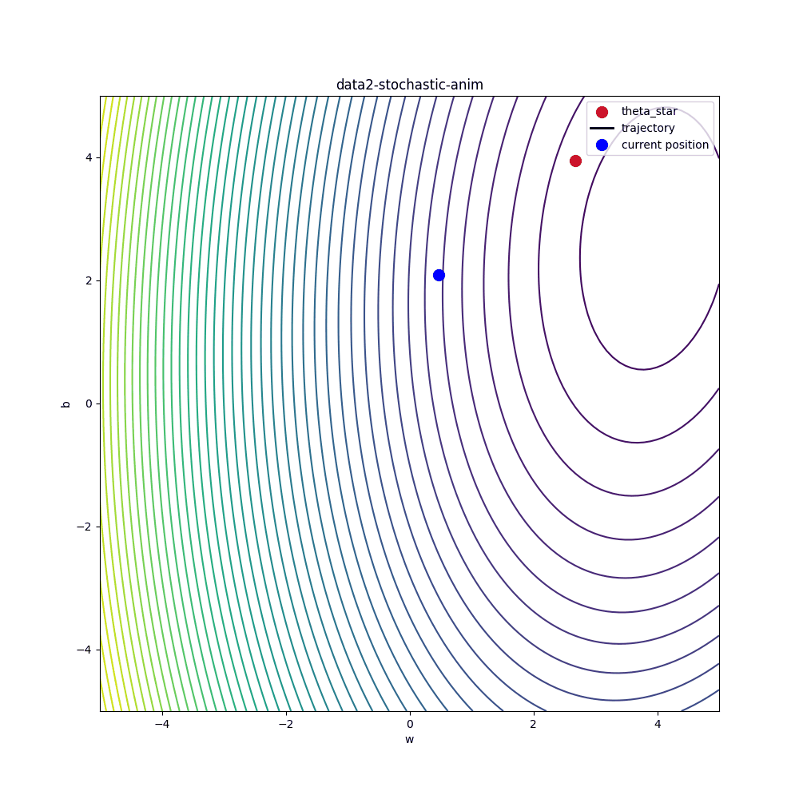

**Momentum**
- 
- 
- 
