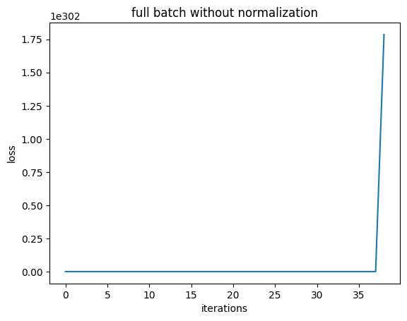
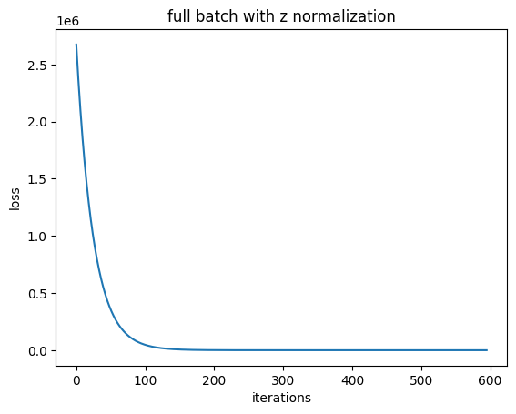

For the given dataset, we can see that without normalization, the model did not converge to the true theta. The loss is still high even after 5000 iterations.

With normalization, the model converged to the true theta. The loss is much lower than the case without normalization.

This concludes that normalization helps in convergence of the model.

